---
# Front matter
title: "Отчет по лабораторной работе №2"
subtitle: "по дисциплине: Операционные системы"
author: "Ким Михаил Алексеевич"

# Generic otions
lang: ru-RU
toc-title: "Содержание"

# Bibliography
bibliography: bib/cite.bib
csl: pandoc/csl/gost-r-7-0-5-2008-numeric.csl

# Pdf output format
toc: true # Table of contents
toc_depth: 2
lof: false # List of figures
lot: false # List of tables
fontsize: 12pt
linestretch: 1.5
papersize: a4
documentclass: scrreprt
## I18n
polyglossia-lang:
  name: russian
  options:
	- spelling=modern
	- babelshorthands=true
polyglossia-otherlangs:
  name: english
### Fonts
mainfont: PT Serif
romanfont: PT Serif
sansfont: PT Sans
monofont: PT Mono
mainfontoptions: Ligatures=TeX
romanfontoptions: Ligatures=TeX
sansfontoptions: Ligatures=TeX,Scale=MatchLowercase
monofontoptions: Scale=MatchLowercase,Scale=0.9
## Biblatex
biblatex: true
biblio-style: "gost-numeric"
biblatexoptions:
  - parentracker=true
  - backend=biber
  - hyperref=auto
  - language=auto
  - autolang=other*
  - citestyle=gost-numeric
## Misc options
indent: true
header-includes:
  - \linepenalty=10 # the penalty added to the badness of each line within a paragraph (no associated penalty node) Increasing the value makes tex try to have fewer lines in the paragraph.
  - \interlinepenalty=0 # value of the penalty (node) added after each line of a paragraph.
  - \hyphenpenalty=50 # the penalty for line breaking at an automatically inserted hyphen
  - \exhyphenpenalty=50 # the penalty for line breaking at an explicit hyphen
  - \binoppenalty=700 # the penalty for breaking a line at a binary operator
  - \relpenalty=500 # the penalty for breaking a line at a relation
  - \clubpenalty=150 # extra penalty for breaking after first line of a paragraph
  - \widowpenalty=150 # extra penalty for breaking before last line of a paragraph
  - \displaywidowpenalty=50 # extra penalty for breaking before last line before a display math
  - \brokenpenalty=100 # extra penalty for page breaking after a hyphenated line
  - \predisplaypenalty=10000 # penalty for breaking before a display
  - \postdisplaypenalty=0 # penalty for breaking after a display
  - \floatingpenalty = 20000 # penalty for splitting an insertion (can only be split footnote in standard LaTeX)
  - \raggedbottom # or \flushbottom
  - \usepackage{float} # keep figures where there are in the text
  - \floatplacement{figure}{H} # keep figures where there are in the text
---

# Цель работы

Изучить идеологию и применение средств контроля версий.

# Выполнение лабораторной работы

## Настройка git

1. Создаем учётную запись на https://github.com. (рис. 2.1)

    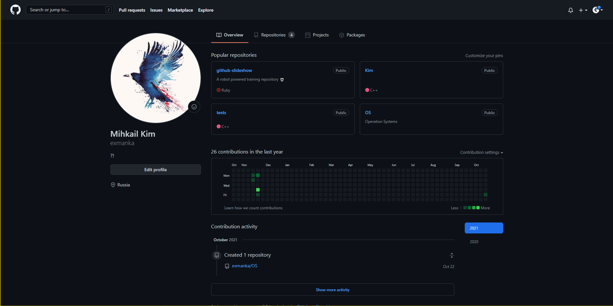

2. Настраиваем систему контроля версий git, как это описано выше c использованием сервера репозиториев https://github.com/:
  
   * Генерируем пару ключей при помощи команды (рис. 2.2):

      ```
      ssh-keygen -C "Mikhail Kim 1032201664@pfur.ru"
      ```

      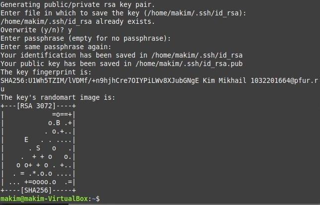

   * Копируем открытый ключ в буфер обмена при помощи команды (рис. 2.3):

      ```
      cat ~/.ssh/id_rsa.pub | xclip -sel clip
      ```

      

   * Загружаем сгенерированный и скопированный ключ на страницу GitHub'a (рис. 2.4):

      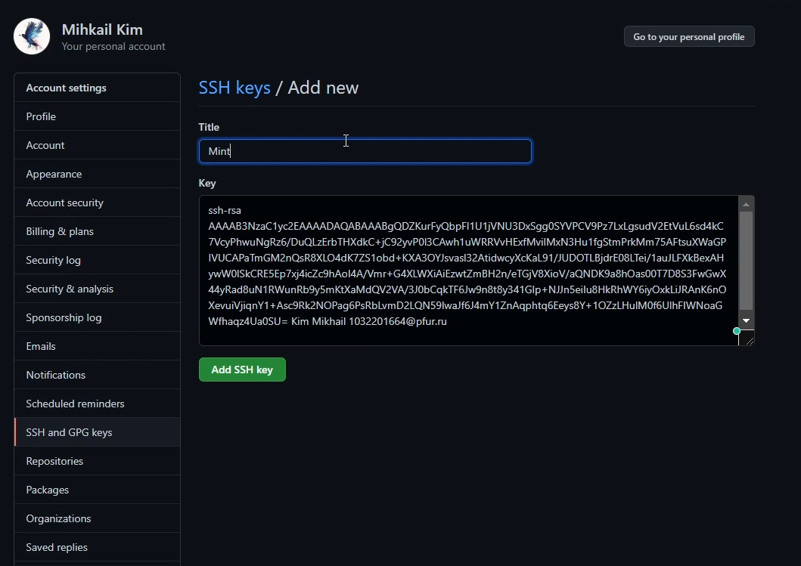

3. Создаем структуру каталога лабораторных работ согласно пункту М.2. (рис. 2.5).

    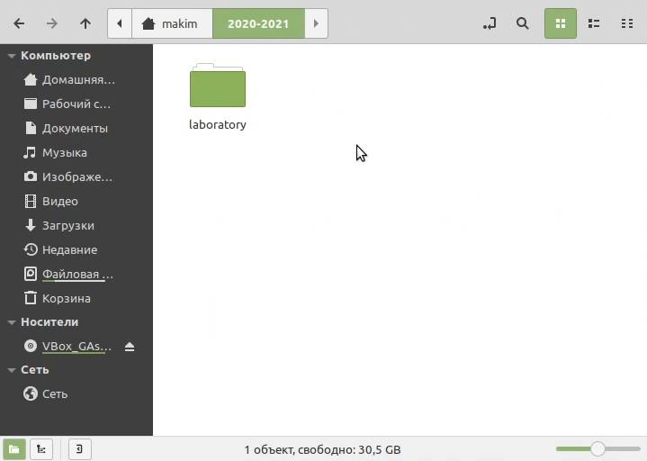

##  Подключение репозитория к github

1. Создаем репозиторий на GitHub. Назовем его OSS. (рис. 2.6).

    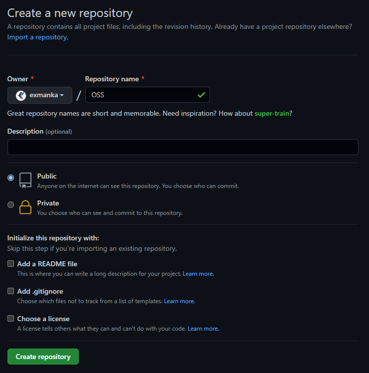

2. Рабочий каталог будем обозначать как laboratory. Переходим в этот каталог.

    ```
    cd laboratory
    ```

1. Инициализируем системы git (рис. 2.7):

    ```
    git init
    ```

2. Создаём заготовку для файла README.md (рис. 2.7):

    ```
    echo "# Лабораторные работы" >> README.md
    git add README.md
    ```

5. Делаем первый коммит и выкладываем на github (рис. 2.7, 2.8, 2.9):

    ```
    git commit -m "first commit"
    git remote add origin git@github.com:<username>sciproc-intro.git
    git push -u origin master
    ```

    

    

    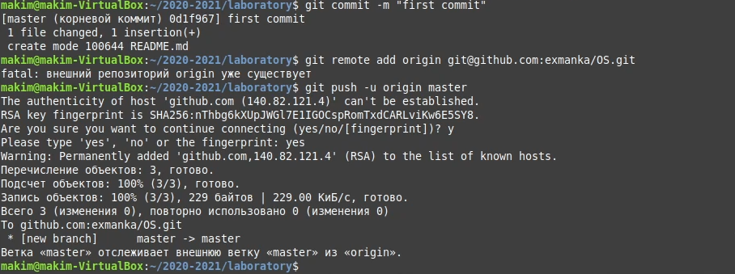

## Первичная конфигурация

1. Добавляем файл лицензии (рис. 2.10):

    ```
    wget https://creativecommons.org/licenses/by/4.0legalcode.txt -O LICENSE
    ```

    

2. Добавляем шаблон игнорируемых файлов. Просмотрим список имеющихся шаблонов (рис. 2.11):

    ```
    curl -L -s https://www.gitignore.io/api/list
    ```

    

3. Затем скачаем шаблон, например, для C (рис. 2.12):

    ```
    curl -L -s https://www.gitignore.io/api/c >> .gitignore ```

    

4. Добавляем новые файлы (рис. 2.13):

    ```
    git add .
    ```

    

5. Выполним коммит (рис. 2.14):

    ```
    git commit -a
    ```

6. Отправим на github (рис. 2.14):

    ```
    git push
    ```

    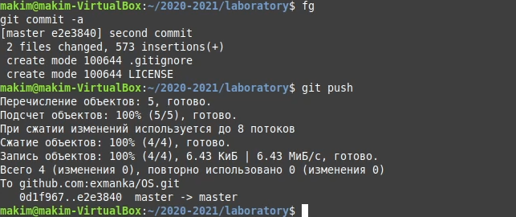

## Конфигурация git-flow

1. Инициализируем git-flow. Префикс для ярлыков установим в v. (рис. 2.15).

    ```
    git flow init
    ```

1. Проверьте, что Вы на ветке develop (рис. 2.15):

    ```
    git branch
    ```

    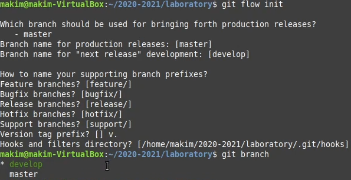

1. Создадим релиз с версией 1.0.0 (рис. 2.16):

    ```
    git flow release start 1.0.0
    ```

1. Запишем версию (рис. 2.16):

    ```
    echo "1.0.0" >> VERSION
    ```

1. Добавим в индекс (рис. 2.16):

    ```
    git add .
    git commit -am 'chore(main): add version'
    ```

    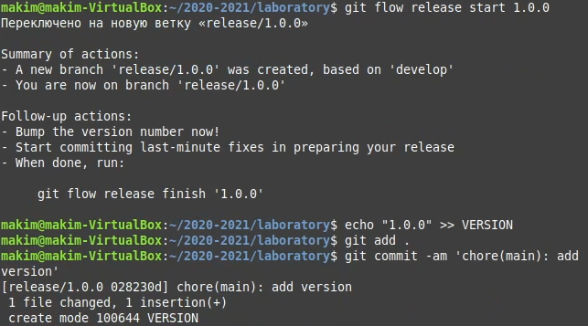

2. Зальём релизную ветку в основную ветку (рис. 2.17):

    ```
    git flow release finish 1.0.0
    ```

    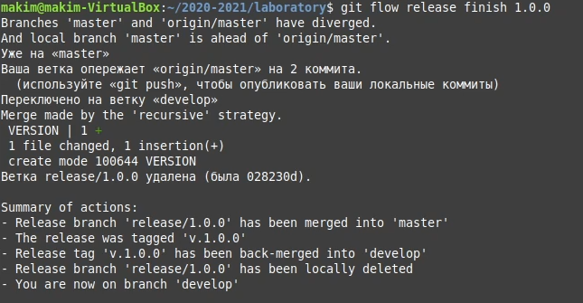

3. Отправим данные на github (рис. 2.18):

    ```
    git push --all
    git push --tags
    ```

    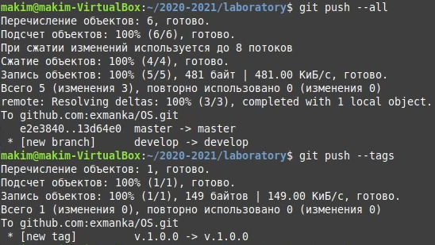

4. Создадим релиз на github (рис. 2.19):

    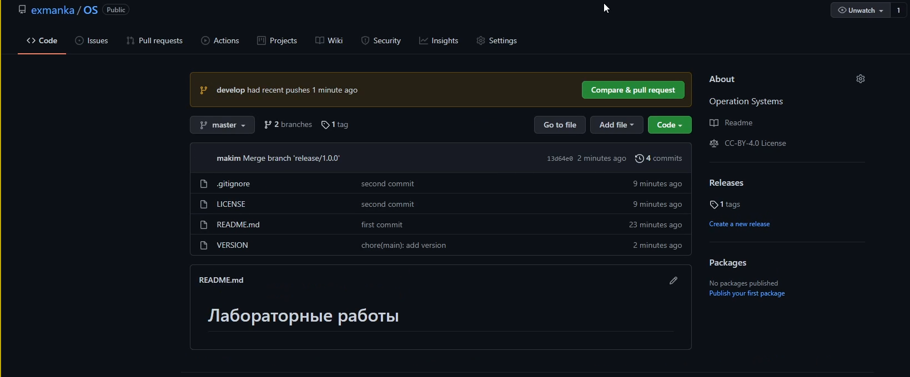

# Выводы

В ходу выполнения данной лабораторной работы я изучил основы применения средств контроля версий, основы использования сайти GitHub, а также разобрался в некоторых элементах работы с git-flow.
